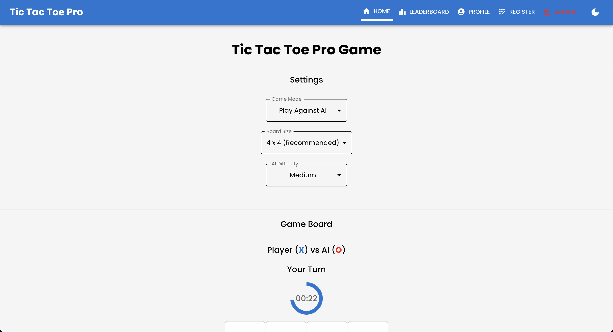
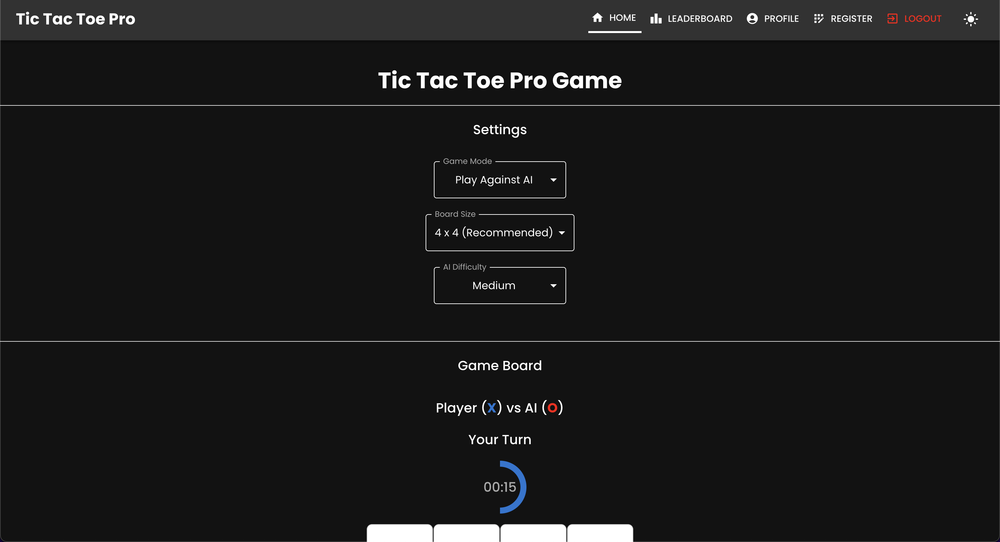
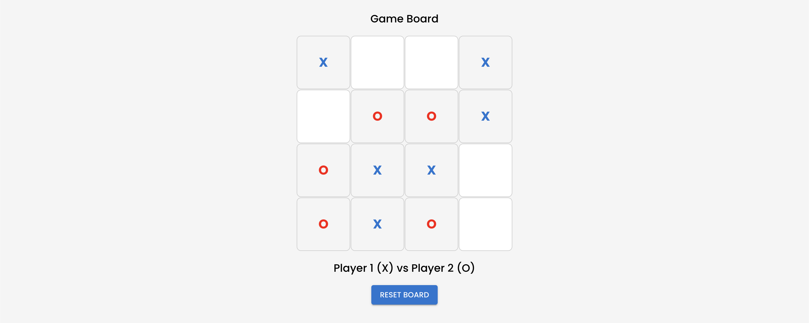
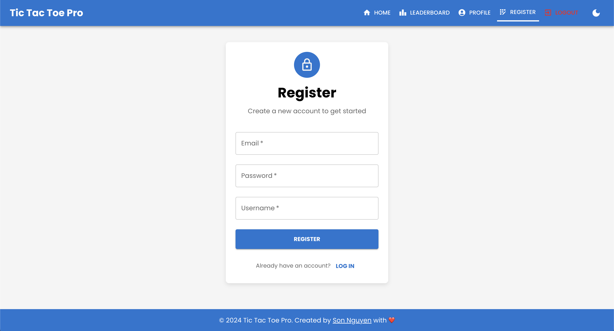
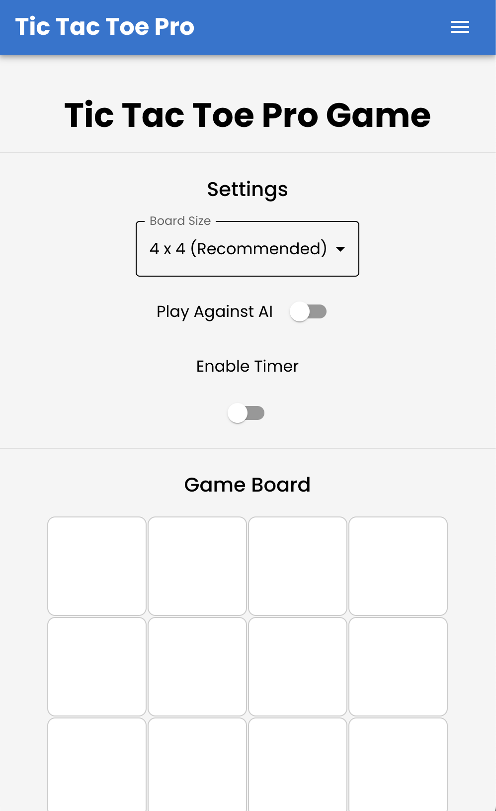

# **Tic Tac Toe Pro Game 🕹️**

Welcome to the **Tic Tac Toe Pro Game**! This is a comprehensive, full-stack application featuring multiplayer Tic Tac Toe gameplay, AI integration, user profiles, leaderboards, and more. The backend is built with **Node.js**, **Express**, and **MongoDB**, while the frontend leverages **React** and **Material-UI** for a polished, responsive user interface.

> **Tech Stack**: **MERN-T** (MongoDB, **Express**, **React**, Node.js with TypeScript)

## **Table of Contents**

- [Overview](#overview)
- [Live Deployment](#live-deployment)
- [Features](#features)
- [Technologies](#technologies)
- [User Interface](#user-interface)
- [File Structure](#file-structure)
- [API Endpoints](#api-endpoints)
- [Setup Instructions](#setup-instructions)
- [Containerization](#containerization)
- [Contributing](#contributing)
- [License](#license)
- [Author](#author)

## **Overview**

The **Tic Tac Toe Pro Game** offers a modern and engaging experience for players to:

- Compete in multiplayer matches or against an AI.
- Track their performance on a global leaderboard.
- Manage their profiles with personalized information and social links.
- Enjoy a seamless UI with light and dark modes.

The app integrates a robust backend API with a dynamic frontend, providing real-time updates and ensuring data security with JWT authentication.

## **Live Deployment**

The Tic Tac Toe Pro Game is live and accessible at the following URLs:

- **Frontend**: [Tic Tac Toe Pro Game](https://tictactoe-ai-app.vercel.app/)
- **Backend**: [Tic Tac Toe Pro API](https://tic-tac-toe-fullstack-game.onrender.com/)
- **Backup**: [Netlify Deployment](https://tictactoe-ai-game.netlify.app)

Feel free to explore the app, play a few games, and check out the leaderboard!

> Note: The app's backend is hosted on Render's free tier, which may experience cold start delays. It may take up to 2 seconds to process backend requests, such as login, registration, or leaderboard functionalities. Please be patient if you encounter any initial delays.

### Deployment Statuses


## **Features**

### **Frontend**

- **Dynamic Gameplay**: Play against friends or AI with varying difficulty levels.
- **Leaderboard**: View top-ranked players and search for specific users.
- **Profile Management**: Update your profile with a bio, social media links, and more.
- **Responsive Design**: Optimized for mobile, tablet, and desktop screens.
- **Dark Mode Support**: Smooth toggling between light and dark themes.

### **Backend**

- **User Authentication**: Secure registration, login, and password reset.
- **ELO System**: Dynamic player rankings based on game results and difficulty.
- **Swagger Documentation**: Interactive API documentation for developers.
- **Game Stats**: Record game results and track wins, losses, and draws.

### **AI Integration**

- **Minimax Algorithm**: AI opponent with optimal move selection.
- **Difficulty Levels**: Choose from easy, medium, and hard AI modes.
- **Real-Time Updates**: Instant feedback on AI moves and game results.

## **Technologies**

### **Frontend**

- React
- Material-UI
- Axios
- React Router
- React Hook Form
- Local Storage for theme persistence

### **Backend**

- Node.js
- Express.js
- MongoDB
- Mongoose ODM
- JWT Authentication
- Swagger UI
- dotenv
- CORS Middleware

### CI/CD

- **GitHub Actions**: Automated workflows for linting, testing, and deployment.
- **Jest & React Testing Library**: For unit and integration testing of React components.
- **ESLint & Prettier**: Linting and code formatting for maintaining code quality.
- **Jenkins**: Continuous integration and deployment for backend services.
- **Docker & Kubernetes**: Containerization and orchestration for scalable deployments.

## **User Interface**

The **Tic Tac Toe Pro Game** frontend features an intuitive and visually appealing UI, offering a seamless experience across devices. Below are placeholders for screenshots of the app:

### Landing Page

The landing page showcases the game's features, including multiplayer gameplay, AI difficulty levels, and global leaderboards.

#### Light Mode

<p align="center">
  
</p>

#### Dark Mode

<p align="center">
  
</p>

### Game Page

The game page allows users to play Tic Tac Toe against friends or AI, with real-time updates and game results.

#### Light Mode

<p align="center">
  
</p>

#### Dark Mode

<p align="center">
  
</p>

#### Game Play

The game page features a responsive game board with real-time updates for player moves and game results.

<p align="center">
  
</p>

#### Game Settings

Here, the user can select the game mode (AI or Multiplayer) and the AI difficulty level. They can also toggle the timer mode, as well as board size.

<p align="center">
  
</p>

### Leaderboard Page

The leaderboard page displays the top-ranked players globally. Users can view their own ranking and search for other players.

#### Light Mode

<p align="center">
  
</p>

#### Dark Mode

<p align="center">
  
</p>

### Profile Page

The profile page allows users to view and update their profile information, including a bio, social media links, and date of birth.

#### Light Mode

<p align="center">
  
</p>

#### Dark Mode

<p align="center">
  
</p>

### Login Page

The login page allows users to sign in with their email and password, with options for password recovery and new user registration.

#### Light Mode

<p align="center">
  
</p>

#### Dark Mode

<p align="center">
  
</p>

### Registration Page

The registration page enables new users to create an account with their email, username, and password.

#### Light Mode

<p align="center">
  
</p>

#### Dark Mode

<p align="center">
  
</p>

### Forgot Password Page

The forgot password page allows users to recover their account by verifying their email address.

#### Light Mode

<p align="center">
  
</p>

#### Dark Mode

<p align="center">
  
</p>

### Responsive Design

#### Mobile View

The app is fully responsive, providing an optimal experience on mobile devices with smooth transitions and interactive elements.

<p align="center">
  
</p>

#### Mobile Drawer

The mobile drawer allows users to navigate between pages and access their profile, leaderboard, and settings.

<p align="center">
  
</p>

## **File Structure**

```
tic-tac-toe-pro/
├── backend/
│   ├── models/
│   │   ├── User.js
│   │   ├── LeaderboardEntry.js
│   ├── routes/
│   │   ├── auth.js
│   │   ├── profile.js
│   │   ├── leaderboard.js
│   ├── middleware/
│   │   ├── authMiddleware.js
│   ├── swagger/
│   │   ├── config.js
│   ├── server.js
│   ├── package.json
│   ├── Dockerfile
│   ├── .env
├── frontend/
│   ├── public/
│   │   ├── favicon.ico
│   │   ├── manifest.json
│   │   ├── sitemap.xml
│   │   ├── robots.txt
│   │   ├── index.html
│   ├── src/
│   │   ├── components/
│   │   │   ├── Board.tsx
│   │   │   ├── Cell.tsx
│   │   │   ├── Navbar.tsx
│   │   │   ├── Footer.tsx
│   │   │   ├── Leaderboard.tsx
│   │   │   ├── Profile.tsx
│   │   │   ├── ForgotPassword.tsx
│   │   │   ├── Login.tsx
│   │   │   ├── Register.tsx
│   │   │   ├── Settings.tsx
│   │   ├── pages/
│   │   │   ├── Home.tsx
│   │   │   ├── LandingPage.tsx
│   │   ├── utils/
│   │   │   ├── api.ts
│   │   │   ├── ai.ts
│   │   │   ├── helpers.ts
│   │   ├── App.tsx
│   │   ├── index.tsx
│   │   ├── index.css
│   │   ├── styles.css
│   │   ├── App.test.tsx
│   │   ├── reportWebVitals.ts
│   ├── package.json
│   ├── tsconfig.json
│   ├── Dockerfile
│   ├── .env
├── kubernetes/
│   ├── configmap.yaml
│   ├── backend-deployment.yaml
│   ├── backend-service.yaml
│   ├── frontend-deployment.yaml
│   ├── frontend-service.yaml
├── nginx/
│   ├── nginx.conf
│   ├── Dockerfile
├── images/
│   ├── landing.png
│   ├── leaderboard.png
│   ├── profile.png
│   ├── game.png
│   ├── mobile-view.png
├── README.md
├── LICENSE
├── .gitignore
├── Dockerfile
├── Jenkinsfile
├── docker-compose.yml
```

## **API Endpoints**

| Endpoint                | Method | Description                                                                           |
| ----------------------- | ------ | ------------------------------------------------------------------------------------- |
| `/auth/register`        | POST   | Register a new user with email, password, and username.                               |
| `/auth/login`           | POST   | Login a user and generate a JWT token.                                                |
| `/auth/forgot-password` | POST   | Verify if a user with the given email exists.                                         |
| `/auth/reset-password`  | POST   | Reset the password for a user.                                                        |
| `/profile`              | GET    | Fetch the authenticated user's profile.                                               |
| `/profile`              | PUT    | Update the authenticated user's profile (bio, date of birth, and social media links). |
| `/profile/games`        | PUT    | Increment the number of games played by the user.                                     |
| `/leaderboard`          | GET    | Fetch the global leaderboard, sorted by ELO.                                          |
| `/leaderboard/match`    | POST   | Report a match result between two players and update their ELO ratings.               |
| `/leaderboard/ai-match` | POST   | Report a match result against AI and update the player's ELO rating.                  |

## **Setup Instructions**

### **Backend**

1. Clone the repository and navigate to the backend folder:
   ```bash
   git clone https://github.com/hoangsonww/Tic-Tac-Toe-Fullstack-Game.git
   cd Tic-Tac-Toe-Fullstack-Game/backend
   ```
2. Install dependencies:
   ```bash
   npm install
   ```
3. Set up environment variables in a `.env` file:
   ```plaintext
   MONGO_URI=your-mongodb-uri
   JWT_SECRET=your-jwt-secret
   ```
4. Start the server:
   ```bash
   npm start
   ```

### **Frontend**

1. Navigate to the frontend folder:
   ```bash
   cd Tic-Tac-Toe-Fullstack-Game/frontend
   ```
2. Install dependencies:
   ```bash
   npm install
   ```
3. Start the React app:
   ```bash
   npm start
   ```

### **Access the App**

- Frontend: `http://localhost:3000`
- Backend API: `http://localhost:4000`
- Swagger UI: `http://localhost:4000/api-docs`
- Live: `https://tictactoe-ai-app.vercel.app/`
- Live API: `https://tic-tac-toe-fullstack-game.onrender.com/`

## **Containerization**

The **Tic Tac Toe Pro Game** can be containerized using Docker for easy deployment and scaling. Below are the steps to build and run the app in a Docker container:

1. **Build and Run the Docker Image**:

   ```bash
   docker-compose up --build
   ```

2. **Access the App**: Visit `http://localhost:3000` to access the frontend and `http://localhost:4000` for the backend API.

## **Contributing**

1. Fork the repository.
2. Create a new branch:
   ```bash
   git checkout -b feature/your-feature
   ```
3. Commit your changes:
   ```bash
   git commit -m "Add your feature"
   ```
4. Push to your branch:
   ```bash
   git push origin feature/your-feature
   ```
5. Submit a pull request.

## **License**

This project is licensed under the **MIT License**. See the [LICENSE](LICENSE) file for details.

## **Author**

- **[Son Nguyen](https://github.com/hoangsonww)**
- Feel free to reach out with any questions or suggestions.

---

**Created in 2024 with ❤️ by [Son Nguyen](https://github.com/hoangsonww)**

[🔝 Back to Top](#docuthinker---ai-powered-document-analysis-and-summarization-app)
