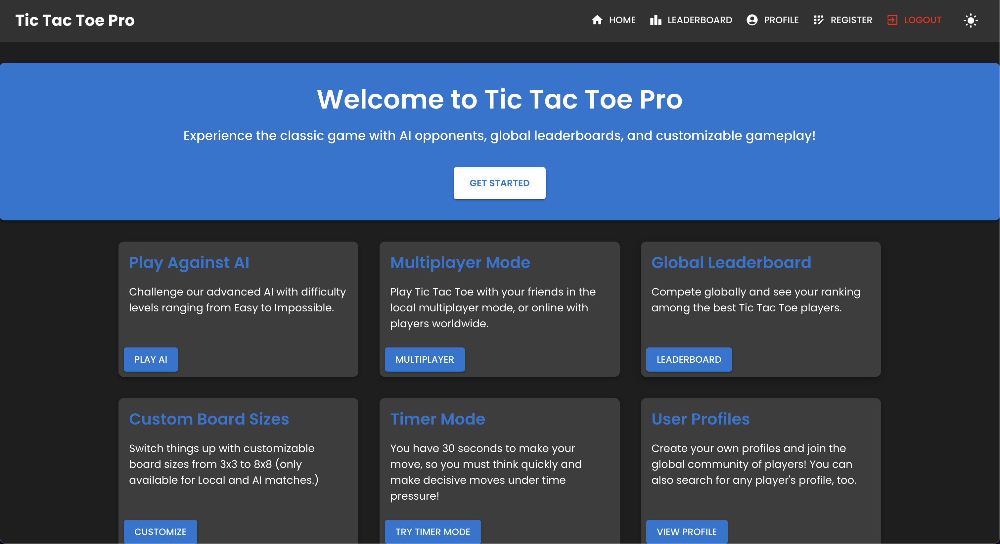
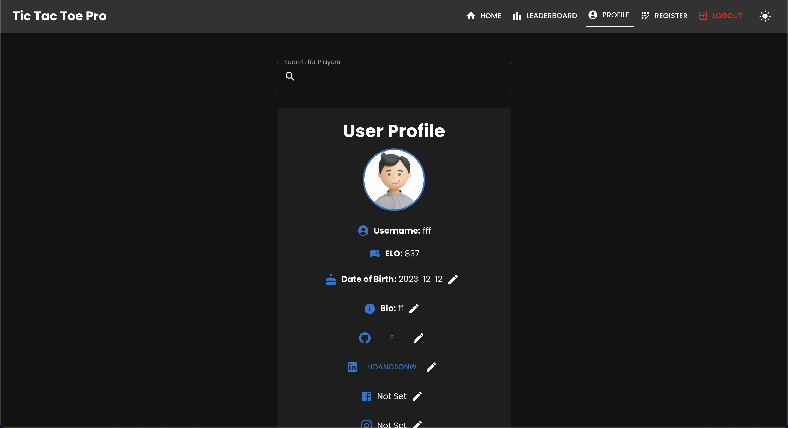

# **Tic Tac Toe Pro Game - Frontend**

Welcome to the **Tic Tac Toe Pro Game** frontend! This is a fully-featured frontend built with **React** and **Material-UI**, designed for a seamless, responsive, and visually appealing gaming experience. The app integrates a leaderboard, user profiles, and multiplayer matches, including AI-based gameplay.

## **Table of Contents**

- [**Overview**](#overview)
- [**Live Demo**](#live-demo)
- [**Features**](#features)
- [**Technologies**](#technologies)
- [**User Interface**](#user-interface)
- [**File Structure**](#file-structure)
- [**Setup Instructions**](#setup-instructions)
- [**API Endpoints**](#api-endpoints)
- [**Contributing**](#contributing)
- [**License**](#license)
- [**Author**](#author)

## **Overview**

The **Tic Tac Toe Pro Game** frontend offers a polished and interactive experience for users to play classic Tic Tac Toe games. It connects to a backend service to enable features like:

- Multiplayer gameplay.
- AI difficulty levels.
- Leaderboards and rankings.
- User profile management.

The app is fully responsive and supports both light and dark modes, with user preferences stored for a personalized experience.

## **Live Demo**

Experience the live app here:

> **Frontend**: [https://tic-tac-toe-pro.com](https://tic-tac-toe-pro.com)  
> **Backend API**: [https://tic-tac-toe-pro-api.com](https://tic-tac-toe-pro-api.com)

## **Features**

### Core Features

- **Dynamic Gameplay**: Play against friends or AI with varying difficulty levels.
- **Leaderboard**: View top-ranked players globally.
- **Profile Management**: Update your profile information, including a bio and social media links.
- **Responsive Design**: Fully optimized for mobile, tablet, and desktop screens.
- **Dark Mode Support**: Toggle between light and dark modes with smooth transitions.

### Interactive Features

- **Global Stats**: Track your wins, losses, and draws.
- **AI Matchmaking**: Compete against AI with difficulty levels like Easy, Medium, Hard, and Impossible.
- **Theme Persistence**: User preferences for light/dark mode are stored in `localStorage`.

## **Technologies**

### Frontend

- **React**: A JavaScript library for building user interfaces.
- **Material-UI**: A modern React UI framework for responsive designs.
- **Axios**: For making API requests to the backend.
- **React Router**: Declarative routing for React applications.
- **React Hook Form**: Lightweight form management for validation and submission.
- **Local Storage**: To persist user settings like dark mode preferences.

### Backend Integration

- **Express.js**: Backend framework for handling API requests.
- **MongoDB**: Database for storing user and leaderboard data.
- **JWT Authentication**: Secure authentication for user login and registration.
- **ELO System**: Algorithm for calculating player rankings and leaderboards.
- **Swagger UI**: Interactive API documentation for backend endpoints.
- **CORS**: Middleware for handling cross-origin resource sharing.
- **bcrypt**: Library for hashing user passwords securely.
- **body-parser**: Middleware for parsing incoming request bodies.

### CI/CD

- **GitHub Actions**: Automated workflows for linting, testing, and deployment.
- **Jest & React Testing Library**: For unit and integration testing of React components.
- **ESLint & Prettier**: Linting and code formatting for maintaining code quality.
- **Jenkins**: Continuous integration and deployment for backend services.
- **Docker & Kubernetes**: Containerization and orchestration for scalable deployments.

## **User Interface**

The **Tic Tac Toe Pro Game** frontend features an intuitive and visually appealing UI, offering a seamless experience across devices. Below are placeholders for screenshots of the app:

### Landing Page

The landing page showcases the game's features, including multiplayer gameplay, AI difficulty levels, and global leaderboards.

#### Light Mode

<p align="center">
  
</p>

#### Dark Mode

<p align="center">
  
</p>

### Game Page

The game page allows users to play Tic Tac Toe against friends or AI, with real-time updates and game results.

#### Light Mode

<p align="center">
  
</p>

#### Dark Mode

<p align="center">
  
</p>

#### Game Play

The game page features a responsive game board with real-time updates for player moves and game results.

<p align="center">
  
</p>

#### Game Settings

Here, the user can select the game mode (AI or Multiplayer) and the AI difficulty level. They can also toggle the timer mode, as well as board size.

<p align="center">
  
</p>

### Leaderboard Page

The leaderboard page displays the top-ranked players globally. Users can view their own ranking and search for other players.

#### Light Mode

<p align="center">
  
</p>

#### Dark Mode

<p align="center">
  
</p>

### Profile Page

The profile page allows users to view and update their profile information, including a bio, social media links, and date of birth.

#### Light Mode

<p align="center">
  
</p>

#### Dark Mode

<p align="center">
  
</p>

### Login Page

The login page allows users to sign in with their email and password, with options for password recovery and new user registration.

#### Light Mode

<p align="center">
  
</p>

#### Dark Mode

<p align="center">
  
</p>

### Registration Page

The registration page enables new users to create an account with their email, username, and password.

#### Light Mode

<p align="center">
  
</p>

#### Dark Mode

<p align="center">
  
</p>

### Forgot Password Page

The forgot password page allows users to recover their account by verifying their email address.

#### Light Mode

<p align="center">
  
</p>

#### Dark Mode

<p align="center">
  
</p>

### Responsive Design

#### Mobile View

The app is fully responsive, providing an optimal experience on mobile devices with smooth transitions and interactive elements.

<p align="center">
  
</p>

#### Mobile Drawer

The mobile drawer allows users to navigate between pages and access their profile, leaderboard, and settings.

<p align="center">
  
</p>

## **File Structure**

```
Tic-Tac-Toe-Pro-Frontend/
├── public/
│   ├── index.html        # Main HTML template
│   └── manifest.json     # Web app manifest
├── src/
│   ├── components/       # Reusable React components
│   │   ├── Navbar.js     # Top navigation bar
│   │   ├── Footer.js     # Footer component
│   │   ├── Leaderboard.js# Leaderboard UI
│   │   ├── Spinner.js    # Loading spinner
│   │   ├── ProtectedRoute.js # Auth-protected routes
│   │   └── ...           # Additional UI components
│   ├── pages/            # Page-specific components
│   │   ├── Home.js       # Homepage
│   │   ├── Login.js      # Login page
│   │   ├── Register.js   # Registration page
│   │   ├── ForgotPassword.js # Forgot password page
│   │   └── ...           # Additional pages
│   ├── styles/           # Custom stylesheets
│   ├── App.js            # Main App component
│   ├── index.js          # Entry point for React
│   ├── api.js            # API configurations and requests
│   └── theme.js          # Dark/Light mode theme settings
├── .env                  # Environment variables
├── package.json          # Project dependencies
├── README.md             # Documentation
└── ...                   # Additional configuration files
```

## **Setup Instructions**

### Prerequisites

- Node.js (v14+)
- npm or yarn
- Backend server running locally or deployed

### Installation

1. Clone the repository:

   ```bash
   git clone https://github.com/your-repo/tic-tac-toe-pro.git
   cd tic-tac-toe-pro/frontend
   ```

2. Install dependencies:

   ```bash
   npm install
   ```

3. Start the development server:

   ```bash
   npm start
   ```

4. Access the app at `http://localhost:3000`.

## **API Endpoints**

The frontend interacts with the following backend endpoints:

| **Method** | **Endpoint**            | **Description**                     |
| ---------- | ----------------------- | ----------------------------------- |
| `POST`     | `/auth/register`        | Registers a new user.               |
| `POST`     | `/auth/login`           | Logs in a user and returns a token. |
| `POST`     | `/auth/forgot-password` | Verifies the user's email.          |
| `POST`     | `/auth/reset-password`  | Resets the user's password.         |
| `GET`      | `/leaderboard`          | Fetches the global leaderboard.     |
| `GET`      | `/profile`              | Retrieves the user's profile data.  |
| `PUT`      | `/profile`              | Updates the user's profile data.    |

## **Contributing**

We welcome contributions to enhance the app! Here's how you can help:

1. Fork the repository.
2. Create a new branch:
   ```bash
   git checkout -b feature/your-feature
   ```
3. Commit your changes:
   ```bash
   git commit -m "Add your feature"
   ```
4. Push to your branch:
   ```bash
   git push origin feature/your-feature
   ```
5. Submit a pull request.

## **License**

This project is licensed under the **MIT License**. See the [LICENSE](LICENSE) file for details.

## **Author**

**[Son Nguyen](https://github.com/hoangsonww)**  
If you have any questions, feel free to reach out!

---

**Created in 2024 with ❤️ by [Son Nguyen](https://github.com/hoangsonww)**
